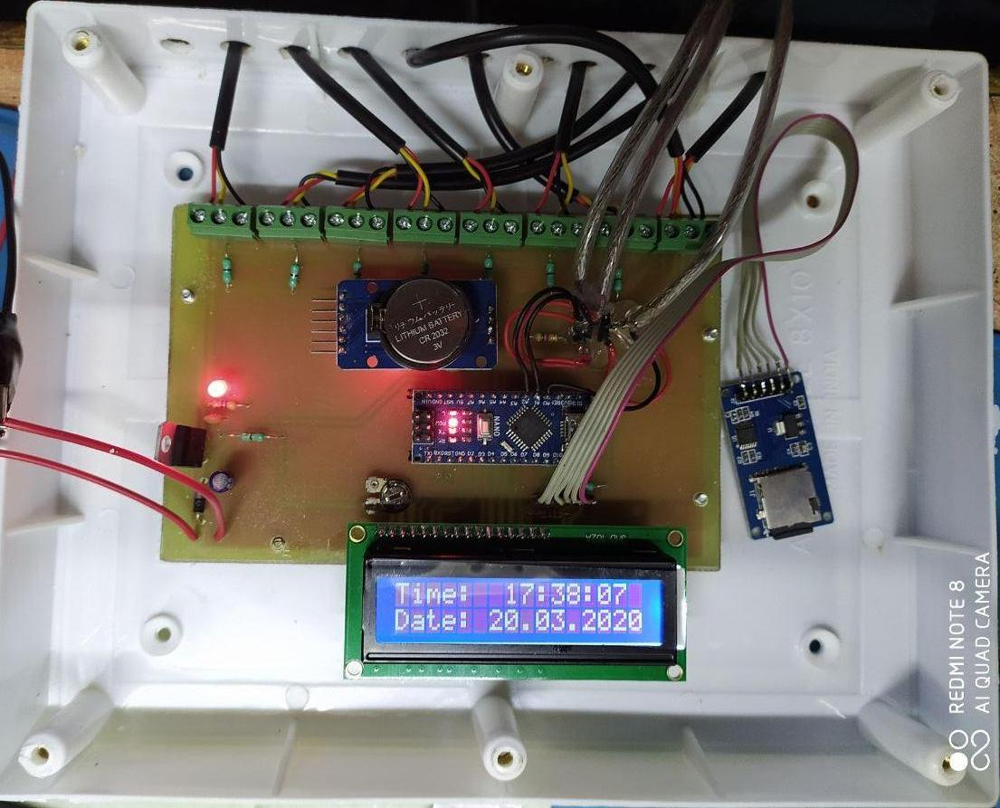
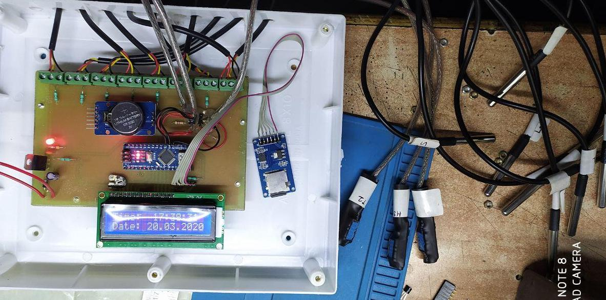

##  Data Logger with SD card and CSV Export    
           
     

#### Project reads data from 9 DS18b20 sensors   
#### alongwith 3 DHT11 sensor for 12 temperature readouts   
### HARDWARE   
Arduino nano ds3231 rtc module sd card module
Arduino ide is used with 16gb fat32 sd card  
project completed on 20/3/2020   
